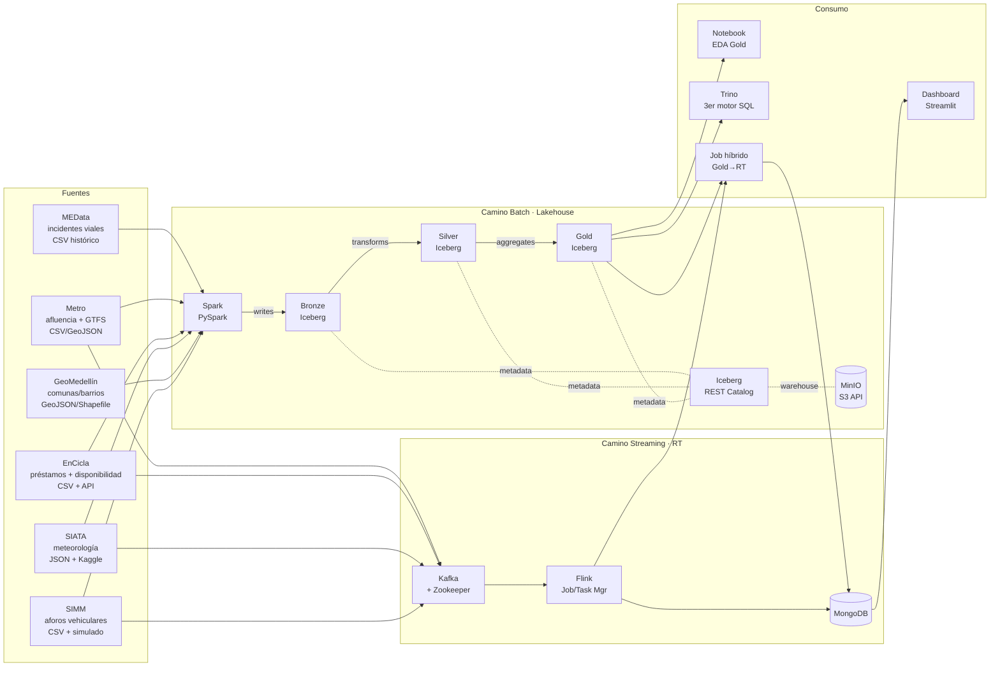
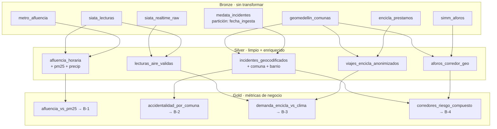

# Arquitectura del Sistema · Pulso Medellín

> Para el detalle de **por qué** elegimos cada tecnología, ver la sección 5 de la propuesta original. Este documento es la versión operacional: **qué corre dónde, cómo se conecta, y cómo razonamos sobre ello**.

---

## Vista general (camino batch + streaming)



---

## Servicios desplegados (Docker Compose)

Todos los servicios corren en una sola red Docker. La red se llama `pulsomed-net`. Los nombres de host coinciden con los nombres de servicio de Compose, así que dentro de la red `minio` es un hostname válido, igual que `kafka`, `iceberg-rest`, etc.

| Servicio | Imagen | Puerto host | Para qué |
|----------|--------|-------------|----------|
| `minio` | `minio/minio:latest` | 9000 (API), 9001 (Console) | Almacenamiento de objetos S3-compatible. Es el "warehouse" físico del Lakehouse. |
| `mc` | `minio/mc:latest` | — | Job de inicialización: crea el bucket `warehouse` en MinIO al arranque. Termina apenas lo crea. |
| `iceberg-rest` | `tabulario/iceberg-rest:1.5.0` | 8181 | Catálogo Iceberg expuesto como REST. Spark, Trino, y notebooks lo consultan para descubrir tablas. |
| `spark-iceberg` | `tabulario/spark-iceberg:latest` | 8888 (Jupyter), 8080 (Spark UI), 10000 (Thrift) | Spark con jars de Iceberg pre-instalados. Sirve también un Jupyter para EDA. |
| `mongodb` | `mongo:7` | 27017 | Sink del streaming. NoSQL documental para alertas y agregados RT. |
| `mongo-express` *(opcional)* | `mongo-express:latest` | 8082 | UI web para inspeccionar MongoDB. Solo en dev. |
| `zookeeper` *(Sprint 2+)* | `confluentinc/cp-zookeeper:7.5.0` | 2181 | Coordinación de Kafka. |
| `kafka` *(Sprint 2+)* | `confluentinc/cp-kafka:7.5.0` | 9092, 29092 | Broker. |
| `kafka-ui` *(Sprint 2+, opcional)* | `provectuslabs/kafka-ui:latest` | 8083 | UI web para inspeccionar tópicos y consumir mensajes. |
| `flink-jobmanager` *(Sprint 2+)* | `flink:1.18` | 8081 | UI y coordinación de jobs. |
| `flink-taskmanager` *(Sprint 2+)* | `flink:1.18` | — | Workers de procesamiento. |
| `trino` *(Sprint 5, bonus)* | `trinodb/trino:latest` | 8084 | Tercer motor SQL sobre Gold. Demuestra interoperabilidad de Iceberg. |

> **Nota sobre puertos:** Trino y Spark UI ambos quieren `:8080` por defecto. Los remapeamos: Spark UI a `:8080` (host), Trino a `:8084` (host). Flink también pelea por `:8080` a veces; lo dejamos en `:8081`.

### ¿Por qué `tabulario/spark-iceberg`?

Es la imagen mantenida por Tabular (los creadores del REST Catalog) que ya trae:
- Spark 3.5 con configuración Iceberg.
- Jars de `iceberg-spark-runtime`, `aws-bundle`, `bundle` AWS S3 SDK ya instalados.
- Jupyter Lab con kernel PySpark listo.
- Variables de entorno preconfiguradas para apuntar al REST Catalog y a un endpoint S3 personalizado.

Esto nos ahorra **horas** de pelear con classpath de Spark + jars compatibles. Si después del Sprint 1 necesitamos personalizar (añadir jars de Kafka connect, MongoDB Spark connector, etc.), creamos un Dockerfile en `docker/spark/` que extiende esta imagen.

---

## Configuración Iceberg (clave)

El namespace que usaremos en Iceberg es `pulsomed`. Las tablas se nombran:

```
pulsomed.bronze.<fuente>      -- ej: pulsomed.bronze.medata_incidentes
pulsomed.silver.<entidad>     -- ej: pulsomed.silver.incidentes_geocodificados
pulsomed.gold.<metrica>       -- ej: pulsomed.gold.afluencia_vs_pm25
```

El warehouse físico vive en `s3://warehouse/pulsomed/` (MinIO). El REST Catalog mapea cada tabla a su ubicación dentro de ese bucket.

### Acceso desde Spark

```python
spark = (
    SparkSession.builder
    .appName("PulsoMedellin")
    .config("spark.sql.catalog.pulsomed", "org.apache.iceberg.spark.SparkCatalog")
    .config("spark.sql.catalog.pulsomed.type", "rest")
    .config("spark.sql.catalog.pulsomed.uri", "http://iceberg-rest:8181")
    .config("spark.sql.catalog.pulsomed.warehouse", "s3://warehouse/")
    .config("spark.sql.catalog.pulsomed.s3.endpoint", "http://minio:9000")
    .config("spark.sql.defaultCatalog", "pulsomed")
    .getOrCreate()
)
```

> En la imagen `tabulario/spark-iceberg`, esto ya viene configurado vía variables de entorno; no hay que pasarlo en cada `SparkSession.builder`. Pero documentar es importante para cuando migremos a la nube.

---

## Decisión: ¿cuándo MongoDB y cuándo Gold?

Esta tabla resume la sección 4.4 de la propuesta y guía toda decisión de diseño:

| Criterio | MongoDB (operacional) | Gold Iceberg (analítica) |
|----------|----------------------|--------------------------|
| **Latencia** | < 10 ms (lectura por clave primaria) | Segundos a minutos (scan + agregación) |
| **Cardinalidad típica** | Baja: últimas N alertas, una estación | Alta: millones de filas históricas |
| **Patrón de escritura** | Continua, sin bloqueo de esquema | Micro-batch / batch nocturno, ACID |
| **Pregunta ejemplo** | "¿cuántas bicis hay en El Poblado AHORA?" | "¿correlación PM2.5–afluencia 2018-2024?" |

**Regla de oro:** si la respuesta requiere mirar más de 10 minutos de historia o cruzar más de una fuente, va a Gold. Si la respuesta es "estado actual de X" o "alertas de los últimos N minutos", va a MongoDB.

---

## Diagrama de Bronze → Silver → Gold



---

## Variables de entorno

Todas las contraseñas y endpoints viven en un único archivo `.env` en la raíz del repo. **Este archivo está en `.gitignore`**. Lo que se versiona es `.env.example` con valores de placeholder.

Ver `.env.example` para la lista completa.

---

## ¿Qué falta documentar?

Estos diagramas se completan en sprints posteriores:

- [ ] Diagrama de tópicos Kafka y consumidores (Sprint 2).
- [ ] Diagrama de jobs Flink con sus ventanas y salidas (Sprint 2-3).
- [ ] Diagrama del job híbrido Gold↔Streaming (Sprint 3).
- [ ] Diagrama de despliegue cloud (Sprint 5).
